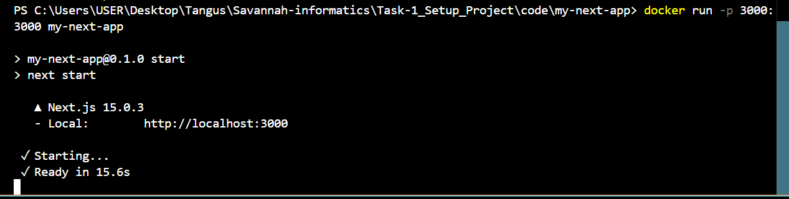

# Task 2: Containerization with Docker

## Objective:
The objective of this task was to containerize the web application developed in Task 1 using Docker. The Docker container should:
- Expose the necessary ports for the web application.
- Include all required dependencies.
- Be able to run the web application seamlessly inside the container.

## Tools Used:
- **Docker**: For containerizing the application.
- **PostgreSQL**: Relational database used by the application.
- **Next.js 15 & TypeScript**: Framework and language used to build the web application.
- **Dockerfile**: Configuration file used to create the Docker image for the application.

## Steps Taken:
1. **Dockerfile Creation**:
   - Created a `Dockerfile` to set up the Node.js environment, install necessary dependencies, and expose port `3000` for the Next.js app.
   - Configured the environment variables for PostgreSQL.

2. **Building the Docker Image**:
   - Built the Docker image using the following command:
     ```
     docker build -t my-next-app .
     ```

3. **Running the Docker Container**:
   - Ran the Docker container with the command:
     ```
     docker run -p 3000:3000 my-next-app
     ```
   - The web application was successfully accessible at `localhost:3000` from the host machine.

4. **Accessing the Web Application**:
   - Verified the accessibility of the web application inside the container by opening the browser and navigating to `localhost:3000`.
   **Below is a screenshot showing the running Docker containers:**



## Challenges Faced:
- **Docker Daemon Issues**: Encountered issues with Docker not running properly, which were resolved by restarting Docker Desktop.
- **PostgreSQL Configuration**: Ensured proper database connectivity inside the Docker container by setting the environment variables correctly and verifying PostgreSQL was running as expected.

## Evaluation Criteria Met:
- **Dockerfile Correctness**:
   - The `Dockerfile` was created according to best practices, including the installation of dependencies, exposing necessary ports, and running the Next.js app.
- **Successful Build and Run**:
   - The Docker image was successfully built and the application ran without errors.
- **Web Application Accessibility**:
   - The web application was accessible within the container at `localhost:3000` and functioned as expected.

## Conclusion:
This task was successfully completed, and the web application is now containerized using Docker. It meets the evaluation criteria, including correct Dockerfile setup, successful container build and run, and the application being accessible within the container.


